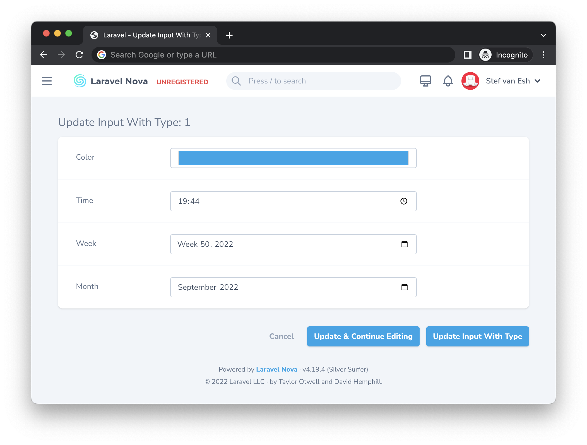

# Nova Input with Type Package

Do you ever just wish you can set an input type for the Nova Field you are creating? You need a field with the time type but there is no package available for this. Wait no more! This extremely simple package lets you set you input yourself.
<strong>
🚨 Please make sure your browser supports the field types you are using!
</strong>


[](https://github.com/marshmallow-packages/nova-input-with-type)
[](https://github.com/marshmallow-packages/nova-input-with-type)
[](https://github.com/marshmallow-packages/nova-input-with-type)
[](https://github.com/marshmallow-packages/nova-input-with-type)

## Installation

You can install the package via composer:

```bash
composer require marshmallow/nova-input-with-type
```

## Usage

You can just call the type method on your new field and nothing extra is needed:

```php
use Marshmallow\InputWithType\InputWithType;

InputWithType::make('Started working at')->type('time'),
```

### Methods

We’ve also created some alias methods for you if you don’t want to use the `type` method. Here are some examples:

### text()

```php
InputWithType::make('My field')->text(),
```

### color()

```php
InputWithType::make('My field')->color(),
```

### date()

```php
InputWithType::make('My field')->date(),
```

### datetimeLocal()

```php
InputWithType::make('My field')->datetimeLocal(),
```

### email()

```php
InputWithType::make('My field')->email(),
```

### hidden()

```php
InputWithType::make('My field')->hidden(),
```

### number()

```php
InputWithType::make('My field')->number(),
```

### password()

```php
InputWithType::make('My field')->password(),
```

### range()

```php
InputWithType::make('My field')
		->range()
    ->min(0)
    ->max(10)
    ->step(2),
```

### tel()

```php
InputWithType::make('My field')->tel(),
```

### time()

```php
InputWithType::make('My field')->time(),
```

### url()

```php
InputWithType::make('My field')->url(),
```

### week()

```php
InputWithType::make('My field')
	->week()
	->min('2018-W18')
	->max('2018-W26'),
```

### month()

```php
InputWithType::make('My field')
	->month()
	->min('2018-03'),
```

### search()

```php
InputWithType::make('My field')->search(),
```

## Changelog

Please see [CHANGELOG](CHANGELOG.md) for more information what has changed recently.

## Testing

```bash
composer test
```

## Security

If you discover any security related issues, please email stef@marshmallow.dev instead of using the issue tracker.

## Credits

-   [Stef van Esch](https://github.com/stefvanesch)
-   [All Contributors](../../contributors)

## License

The MIT License (MIT). Please see [License File](LICENSE.md) for more information.
